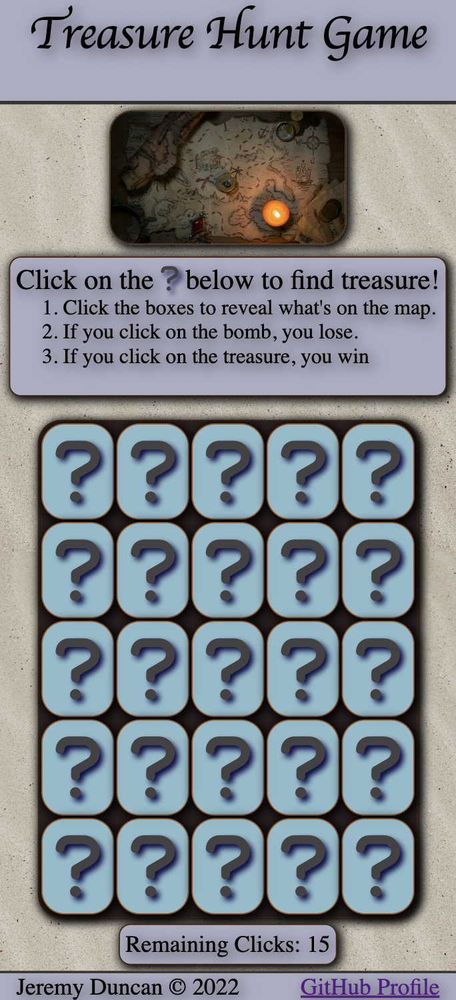
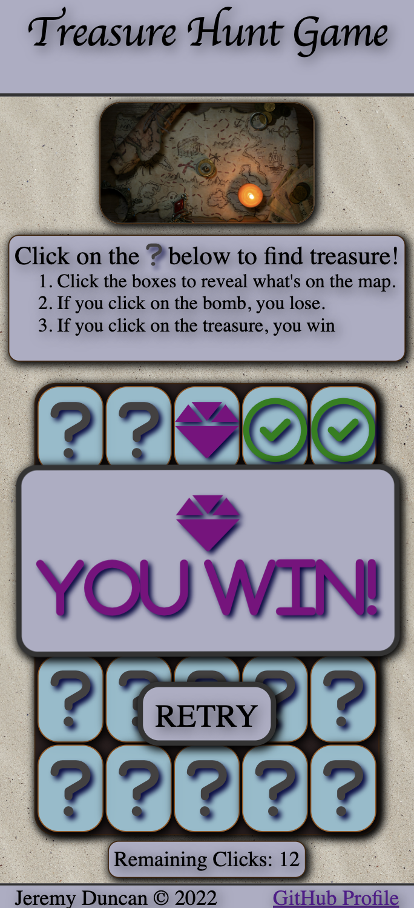

# treasure_hunt
A treasure hunt game I made using HTML, Javascript, and CSS.
- You win if you click on the correct box with the diamond.
- You lose if you click on the box with the bomb.
- You lose if you click counter reaches 0.
#

#